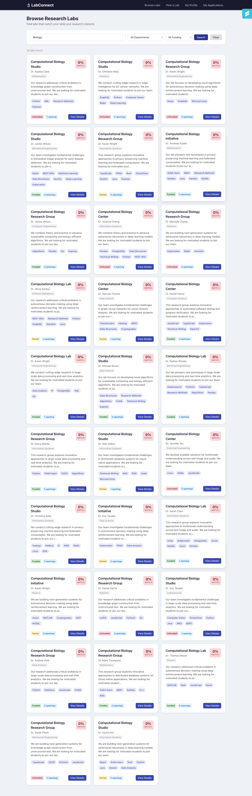
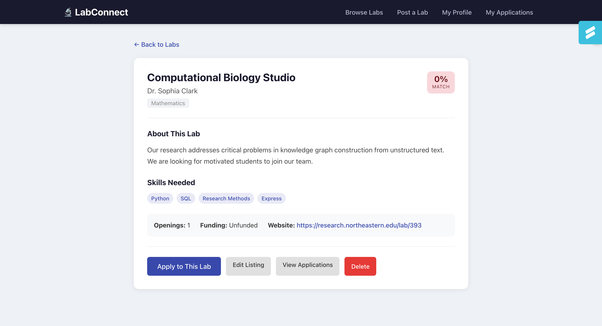
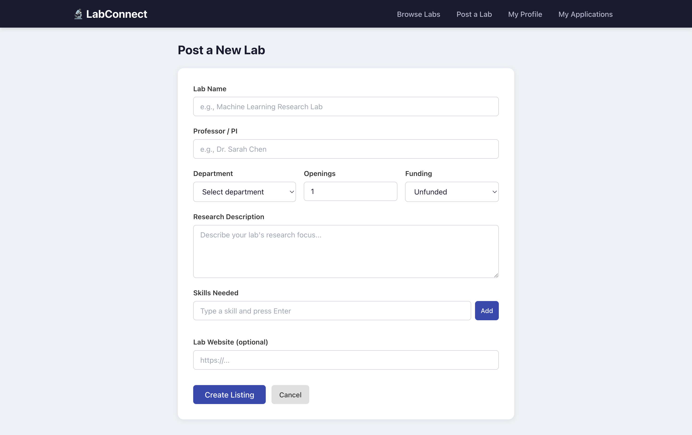
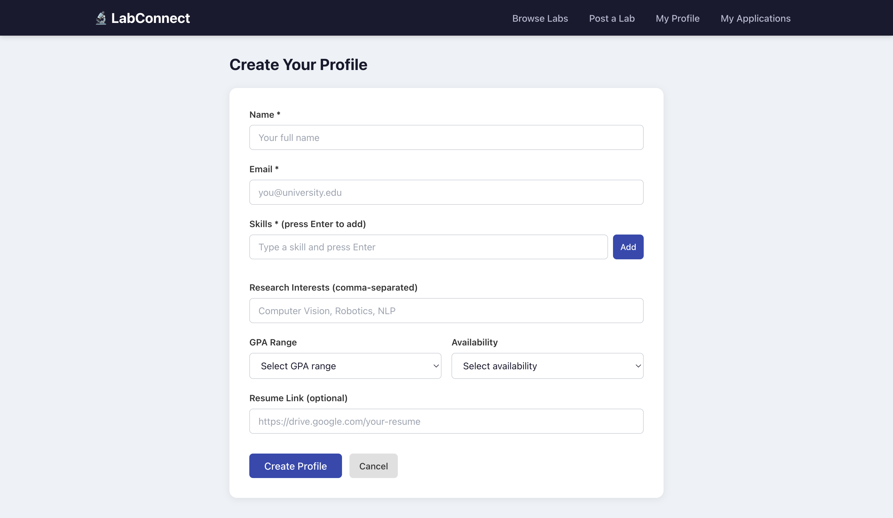
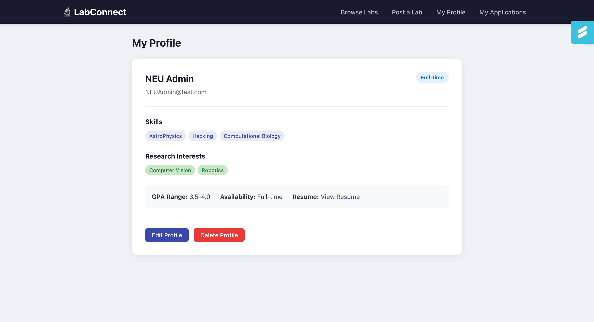
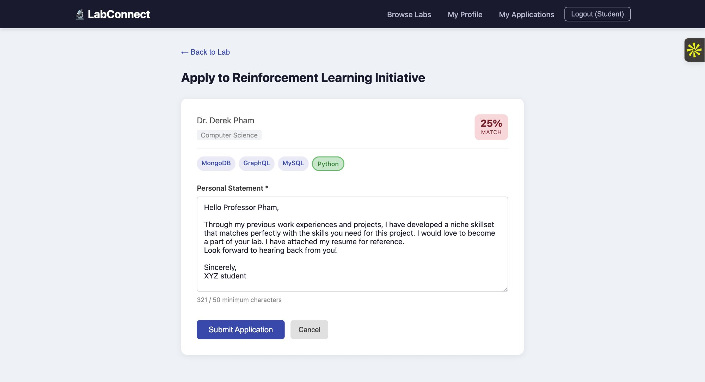
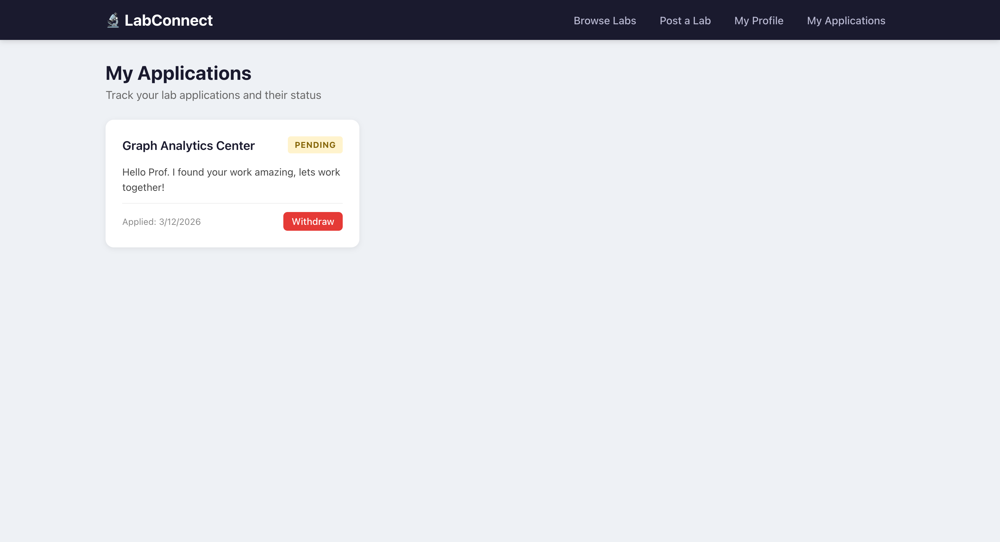
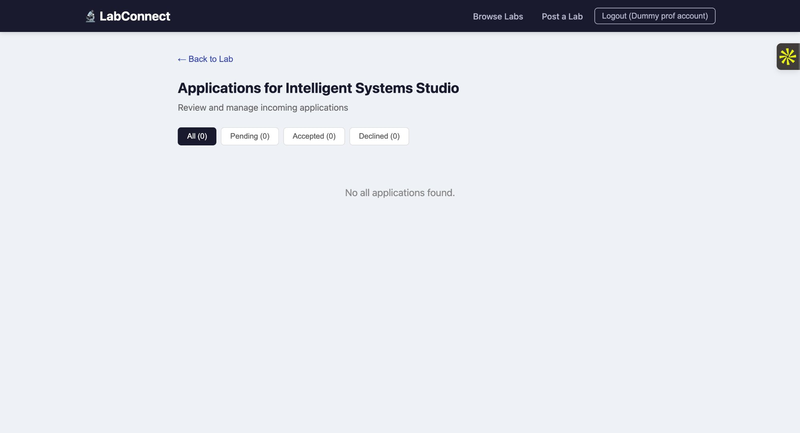

# LabConnect

> Research Lab Discovery and Matching Platform for Graduate Students

[](LICENSE)
[](https://nodejs.org/)
[](https://www.mongodb.com/atlas)

---

## Authors

- **Prasad Kanade** — Lab Listings & Skill Matching
- **Saurabh Lohokare** — Student Profiles & Applications

---

## Course

[Web Development — Spring 2026](https://northeastern.instructure.com/courses/245751)
Northeastern University — Instructor: John Alexis Guerra Gomez

---

## Project Objective

LabConnect solves the painful process graduate students face when searching for research labs. The current workflow — browsing outdated faculty pages and cold-emailing dozens of professors — is inefficient and discouraging.

LabConnect lets professors post lab listings with required skills, open positions, and funding status. Students create profiles listing their technical skills and research interests. The platform calculates a skill-match percentage between each student and each lab, ranks results by relevance, and lets students apply directly with a personal statement. Professors review incoming applications with match scores attached, making it easy to surface the strongest candidates.

---

## Screenshots

### Browse Labs


### Lab Detail


### Lab Form


### Profile Form


### Profile View


### Application Form


### My Applications


### Application Review


---

## Tech Stack

- **Backend:** Node.js, Express 5, MongoDB Atlas (native driver)
- **Frontend:** React 19, React Router, Vite
- **Code Quality:** ESLint, Prettier

---

## Instructions to Build

### Prerequisites

- Node.js v18 or higher
- npm v9 or higher
- MongoDB Atlas account (free tier works)

### Setup

1. **Clone the repository**

   ```bash
   git clone https://github.com/prasad0411/LabConnect.git
   cd LabConnect
   ```

2. **Install backend dependencies**

   ```bash
   npm install
   ```

3. **Install frontend dependencies**

   ```bash
   cd client
   npm install
   cd ..
   ```

4. **Configure environment variables**

   Copy `.env.example` to `.env` and fill in your values:

   ```bash
   cp .env.example .env
   ```

   ```env
   MONGO_URI=mongodb+srv://<username>:<password>@cluster.mongodb.net/labconnect
   PORT=3000
   ```

5. **Seed the database**

   ```bash
   npm run seed
   ```

6. **Build the frontend**

   ```bash
   cd client
   npm run build
   cd ..
   ```

7. **Start the server**

   ```bash
   npm start
   ```

8. **Open in browser**

   ```
   http://localhost:3000
   ```

### Development Mode

Run the backend with auto-reload and the frontend dev server in parallel:

```bash
npm run dev
```

```bash
cd client && npm run dev
```

---

## API Endpoints

### Labs

| Method   | Endpoint        | Description           |
| -------- | --------------- | --------------------- |
| `GET`    | `/api/labs`     | List all labs (filterable by department, skill, funding, search) |
| `GET`    | `/api/labs/:id` | Get a single lab      |
| `POST`   | `/api/labs`     | Create a lab listing  |
| `PUT`    | `/api/labs/:id` | Update a lab listing  |
| `DELETE` | `/api/labs/:id` | Delete a lab listing  |

### Profiles

| Method   | Endpoint             | Description        |
| -------- | -------------------- | ------------------ |
| `GET`    | `/api/profiles`      | List all profiles  |
| `GET`    | `/api/profiles/:id`  | Get a profile      |
| `POST`   | `/api/profiles`      | Create a profile   |
| `PUT`    | `/api/profiles/:id`  | Update a profile   |
| `DELETE` | `/api/profiles/:id`  | Delete a profile   |

### Applications

| Method    | Endpoint                          | Description                   |
| --------- | --------------------------------- | ----------------------------- |
| `GET`     | `/api/applications`               | List applications (filterable by labId or profileId) |
| `GET`     | `/api/applications/:id`           | Get a single application      |
| `POST`    | `/api/applications`               | Submit an application         |
| `PUT`     | `/api/applications/:id`           | Update application statement  |
| `PATCH`   | `/api/applications/:id/status`    | Accept or decline             |
| `DELETE`  | `/api/applications/:id`           | Withdraw an application       |

---

## License

This project is licensed under the MIT License — see the [LICENSE](LICENSE) file for details.

---

<p align="center">Made by Prasad Kanade & Saurabh Lohokare</p>