# LabConnect — Design Document

**Research Lab Discovery and Matching Platform for Graduate Students**

- **Authors:** Prasad Kanade, Saurabh Lohokare
- **Course:** Web Development — Spring 2026, Northeastern University
- **Instructor:** John Alexis Guerra Gomez
- **Live Site:** https://labconnect-w18c.onrender.com
- **Repository:** https://github.com/prasad0411/LabConnect

---

## Table of Contents

1. [Project Description](#1-project-description)
2. [User Personas](#2-user-personas)
3. [User Stories](#3-user-stories)
4. [Design Mockups](#4-design-mockups)
5. [Data Model](#5-data-model)
6. [API Design](#6-api-design)
7. [Technology Decisions](#7-technology-decisions)

---

## 1. Project Description

### Overview

LabConnect is a research lab discovery and matching platform for graduate students at Northeastern University. Every semester, MS and PhD students face the same struggle: finding a professor or research lab to work with. The current process is painful — browse department websites with outdated info, cold-email 20 professors, get 2 replies.

LabConnect fixes this by letting professors list their labs with current openings, required skills, project descriptions, and funding status. Students create profiles with their technical skills, research interests, and availability. The platform calculates a skill-match percentage between a student and each lab, ranks labs by relevance, and lets students apply directly with a personal statement. Professors see incoming applications with match scores, making it easy to identify strong candidates.

### Problem Statement

Graduate students at Northeastern face three core problems when searching for research opportunities:

- **No centralized listings** — Lab openings are scattered across faculty pages that are rarely updated.
- **Cold outreach failure** — Students send dozens of emails with low response rates because there is no signal of mutual fit.
- **No skill alignment** — Professors receive applications from students who lack the required technical background, wasting time on both sides.

### Solution

LabConnect provides four core capabilities:

1. **Lab Listings** — Professors post labs with description, required skills, openings, funding status, and website.
2. **Student Profiles** — Students list their skills, research interests, GPA range, availability, and resume link.
3. **Skill Match Scoring** — The platform calculates a match percentage between each student and each lab, highlighting matching skills in real time.
4. **Direct Applications** — Students apply with a personal statement; professors review applications with match scores attached.

### Key Features

- Role-based authentication — students and professors see completely different interfaces
- Skill-match percentage badge on every lab card and detail page (students only)
- Labs sorted by match score — best fits appear first
- Matching skills highlighted in green with a ✓ checkmark on the lab detail page
- Duplicate application prevention — one application per lab per student
- Full application lifecycle — submit, withdraw (student), accept/decline (professor)
- Account deletion — removes user, profile, and all applications atomically

---

## 2. User Personas

### Persona 1: Priya — Skill-Seeking Grad Student

| Attribute       | Detail                                                                                           |
| --------------- | ------------------------------------------------------------------------------------------------ |
| **Name**        | Priya Sharma                                                                                     |
| **Age**         | 23                                                                                               |
| **Program**     | MS in Computer Science, first semester, Northeastern University                                  |
| **Skills**      | Python, Machine Learning, TensorFlow, SQL                                                        |
| **Frustration** | Has emailed 15 professors with zero replies. No way to signal technical fit before reaching out. |
| **Goal**        | Find labs that need her ML skills and apply where she has the highest match percentage.          |

### Persona 2: Dr. Marcus — Research Lab Director

| Attribute       | Detail                                                                                                      |
| --------------- | ----------------------------------------------------------------------------------------------------------- |
| **Name**        | Dr. Marcus Chen                                                                                             |
| **Age**         | 42                                                                                                          |
| **Role**        | Professor, NLP Lab, 3 open positions                                                                        |
| **Frustration** | Receives generic emails from students who have not read his research or checked his skill requirements.     |
| **Goal**        | Post openings with specific skill requirements and review only qualified applicants, ranked by match score. |

### Persona 3: Aisha — Exploring Student

| Attribute       | Detail                                                                                           |
| --------------- | ------------------------------------------------------------------------------------------------ |
| **Name**        | Aisha Johnson                                                                                    |
| **Age**         | 22                                                                                               |
| **Program**     | MS in Data Science, second semester                                                              |
| **Frustration** | Unsure whether to pursue research or industry. No easy way to explore lab options casually.      |
| **Goal**        | Browse labs, read project descriptions, and see skill match before committing to an application. |

---

## 3. User Stories

### Lab Listings & Skill Matching — Prasad Kanade

**US-1.1 — Create a Lab Listing**
As a professor, I want to create a lab listing with my name, department, research description, required skills, number of openings, and funding status, so qualified students can discover my lab.

**US-1.2 — Edit or Delete a Lab Listing**
As a professor, I want to edit or delete my lab listing, so I can update openings and requirements as positions fill.

**US-1.3 — Browse Lab Listings**
As a student, I want to browse all lab listings and filter by department, required skill, and funding status, so I can find labs relevant to me.

**US-1.4 — Skill Match Percentage**
As a student, I want to see a skill-match percentage between my profile and each lab, so I can prioritize where I am the strongest fit.

**US-1.5 — Sorted and Highlighted Results**
As a student, I want labs sorted by match score with matching skills highlighted, so the best opportunities surface first.

**US-1.6 — Keyword Search**
As a student, I want to search labs by keyword such as "machine learning" or "NLP", so I can quickly find labs in my area of interest.

### Student Profiles & Applications — Saurabh Lohokare

**US-2.1 — Create a Profile**
As a student, I want to create a profile with my name, email, skills, research interests, GPA range, availability, and resume link, so professors can evaluate me.

**US-2.2 — Edit or Delete a Profile**
As a student, I want to edit or delete my profile, so my information stays current as I learn new skills.

**US-2.3 — Apply to a Lab**
As a student, I want to apply to a lab with a personal statement, so the professor understands why I am interested and what I can contribute.

**US-2.4 — Track Applications**
As a student, I want to view my submitted applications and their status — pending, accepted, or declined — so I can track my progress.

**US-2.5 — Review Applications**
As a professor, I want to view all applications for my lab with each applicant's match score and personal statement, so I can evaluate candidates efficiently.

**US-2.6 — Accept or Decline Applications**
As a professor, I want to accept or decline applications, so students get timely responses instead of silence.

---

## 4. Design Mockups

All screenshots are taken from the live deployed application at https://labconnect-w18c.onrender.com.

---

### 4.1 Sign In

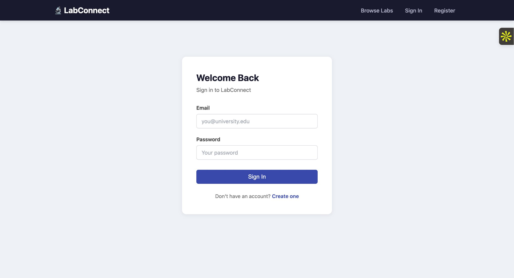

The Sign In page is the default landing page for unauthenticated users. It collects email and password. A "Create one" link navigates to the Register page. The navbar shows Browse Labs, Sign In, and Register for unauthenticated users.

---

### 4.2 Register

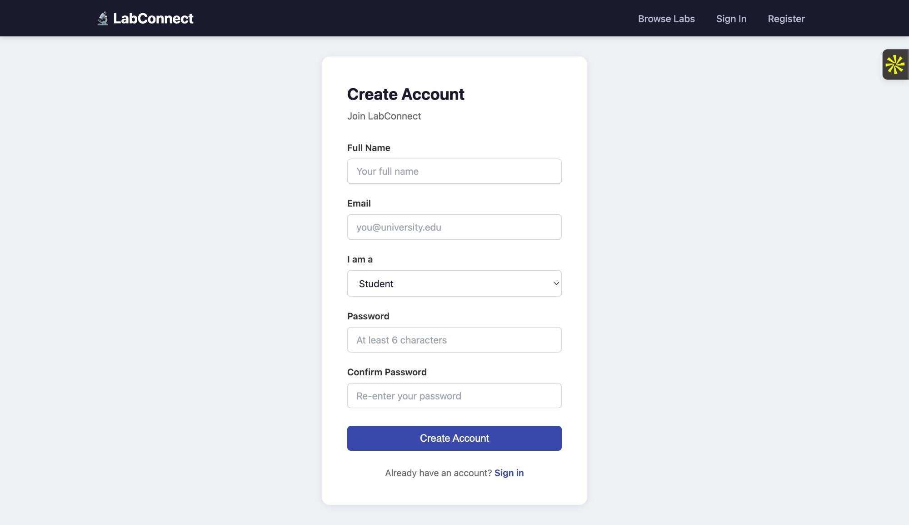

The Register page collects full name, email, role (Student or Professor), password, and password confirmation. The role selection at registration determines every subsequent UI and API permission decision. Passwords must be at least 6 characters and are hashed with bcryptjs before storage.

---

### 4.3 Browse Labs — Student View (with skill-match badges)

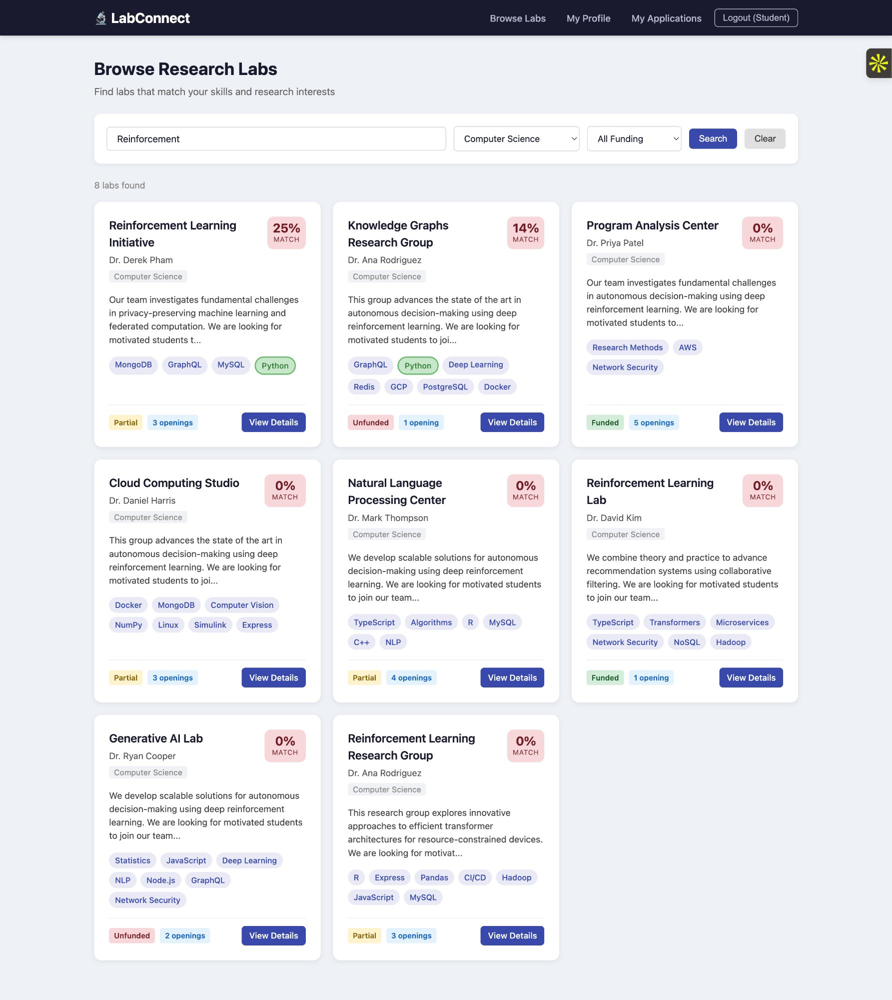

The core discovery page for students. The filter bar supports keyword search (across lab name, professor, and description), department dropdown, and funding status dropdown. Each lab card shows the lab name, professor, department tag, a truncated description, required skill tags, funding badge, openings count, and a skill-match percentage badge in the top right corner.

The screenshot shows a search for "Reinforcement" filtered to Computer Science — 8 labs found. The **Reinforcement Learning Initiative** (Dr. Derek Pham) shows a **25% match** badge because the student has Python, which matches 1 of 4 required skills. Labs are sorted by match score so highest-fit opportunities appear first. The student navbar shows Browse Labs, My Profile, My Applications, and Logout.

---

### 4.4 Lab Detail — Student View

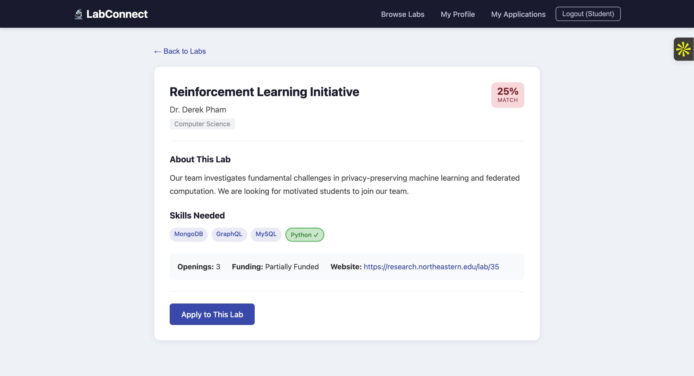

The full lab detail page for a student. Shows the lab name (**Reinforcement Learning Initiative**), professor (Dr. Derek Pham), department (Computer Science), the 25% match badge, a full research description, and the Skills Needed section.

Matching skills are highlighted in green with a ✓ checkmark — **Python ✓** is highlighted because the student has it. Non-matching skills (MongoDB, GraphQL, MySQL) remain in the default style. Metadata row shows Openings: 3, Funding: Partially Funded, and a Website link. The Apply to This Lab button appears for students who have not yet applied. After applying, the button is replaced by an "Applied" badge.

---

### 4.5 Application Form

The application form shows the lab name (**Apply to Reinforcement Learning Initiative**), professor (Dr. Derek Pham), department, and the 25% match badge at the top. Required skills are displayed as tags — Python is highlighted in green because the student has it, confirming their fit at a glance.

The Personal Statement textarea requires a minimum of 50 characters. A live counter shows current character count (321/50 minimum characters in the screenshot). The student cannot submit without meeting the minimum. Submit Application and Cancel buttons are present.

---

### 4.6 My Applications — Student View

The My Applications page shows all applications the student has submitted. Each card shows the lab name, match score, personal statement preview, date applied, current status badge (PENDING in yellow), and a Withdraw button for pending applications.

The screenshot shows two applications: **Computational Biology Studio** (50% match, PENDING, applied 3/19/2026) and **Reinforcement Learning Initiative** (25% match, PENDING, applied 3/19/2026). Once a professor accepts or declines, the Withdraw button disappears.

---

### 4.7 Withdraw Confirmation Dialog

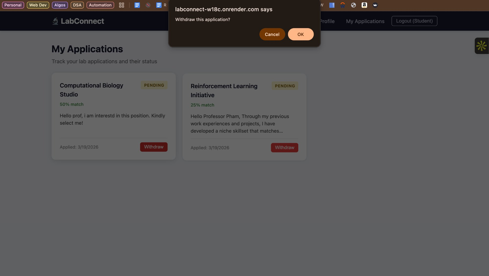

Clicking Withdraw triggers a browser confirmation dialog: "Withdraw this application?" with Cancel and OK options. This prevents accidental withdrawals. On confirmation, the application is deleted via `DELETE /api/applications/:id` and removed from the list immediately.

---

### 4.8 My Profile — Student View

The profile card displays the student's name, email (kanade.pra@northeastern.edu), and a Full-time availability badge. Skills are shown as pill tags (sql, Python, Biology, Physics). Research Interests are shown in green pill tags (NLP, Robotics). The metadata row shows GPA Range: 3.5–4.0, Availability: Full-time, and a View Resume link.

Two action buttons appear at the bottom: Edit Profile (opens the edit form inline) and Delete Account (triggers a confirmation dialog before permanently deleting the account, profile, and all applications).

---

### 4.9 Edit Profile

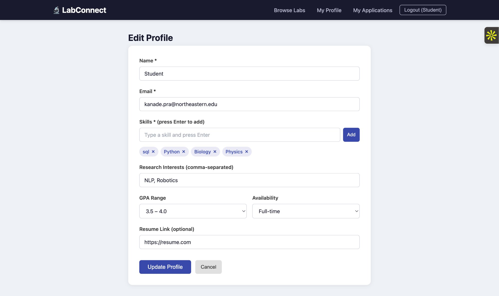

The edit profile form is pre-populated with the student's existing data. Name shows "Student", email shows "kanade.pra@northeastern.edu". Skills appear as removable tags (sql ×, Python ×, Biology ×, Physics ×). Research Interests field shows "NLP, Robotics". GPA Range is set to 3.5–4.0, Availability to Full-time, and Resume Link to https://resume.com. Update Profile and Cancel buttons are present. Submitting hits `PUT /api/profiles/:id`.

---

### 4.10 Delete Account Confirmation Dialog

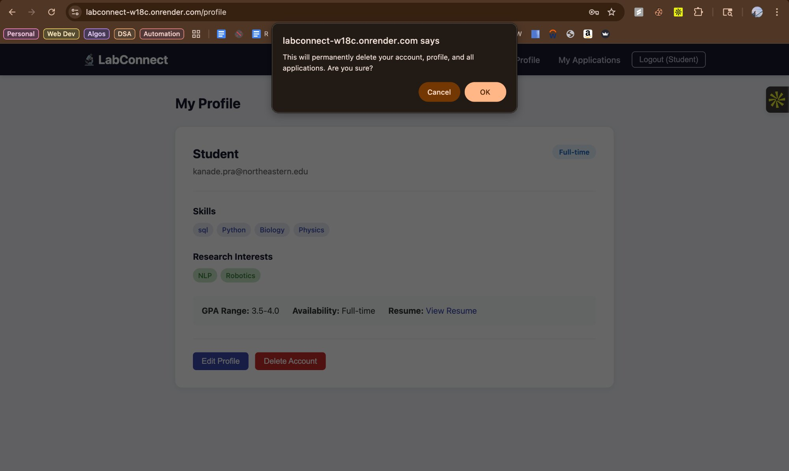

Clicking Delete Account shows a browser confirmation: "This will permanently delete your account, profile, and all applications. Are you sure?" On confirmation, `DELETE /api/auth/account` is called, which removes the user from `users`, deletes their profile from `profiles`, deletes all their applications from `applications`, logs them out, and redirects to the Register page.

---

### 4.11 Browse Labs — Professor View (no match badges)

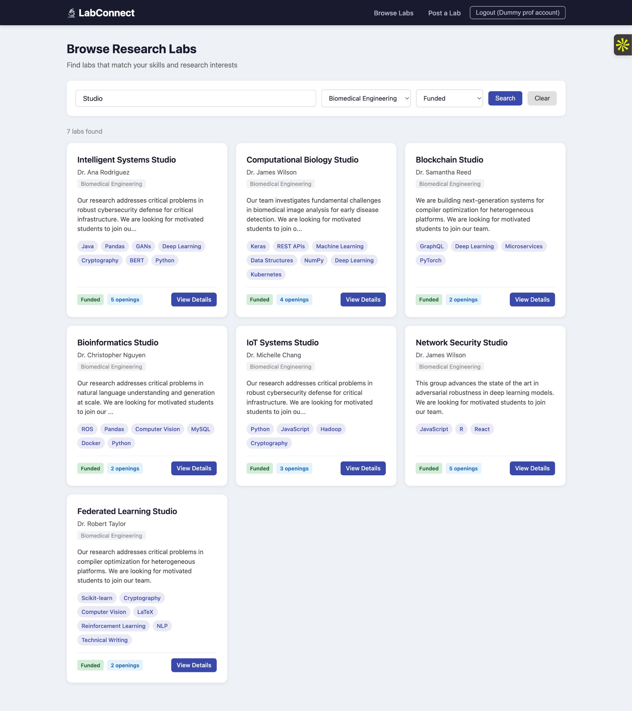

The professor's Browse Labs view is identical in layout but shows no skill-match badges — professors do not have student profiles so match scoring is irrelevant. The navbar shows Browse Labs, Post a Lab, and Logout (Dummy prof account).

The screenshot shows a search for "Studio" filtered to Biomedical Engineering, Funded — 7 results including Intelligent Systems Studio (Dr. Ana Rodriguez, 5 openings), Computational Biology Studio (Dr. James Wilson, 4 openings), Blockchain Studio (Dr. Samantha Reed, 2 openings), Bioinformatics Studio (Dr. Christopher Nguyen), IoT Systems Studio (Dr. Michelle Chang), Network Security Studio (Dr. James Wilson), and Federated Learning Studio (Dr. Robert Taylor).

---

### 4.12 Lab Detail — Professor View

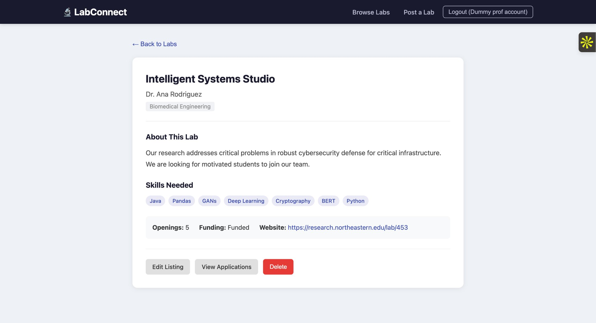

The professor's lab detail view for **Intelligent Systems Studio** — Dr. Ana Rodriguez, Biomedical Engineering. Research description, Skills Needed (Java, Pandas, GANs, Deep Learning, Cryptography, BERT, Python), Openings: 5, Funding: Funded, Website link.

No match badge is shown. No Apply button. Instead, three professor-only action buttons appear: Edit Listing, View Applications, and Delete. These are hidden from student users entirely.

---

### 4.13 Edit Lab Listing — Professor View

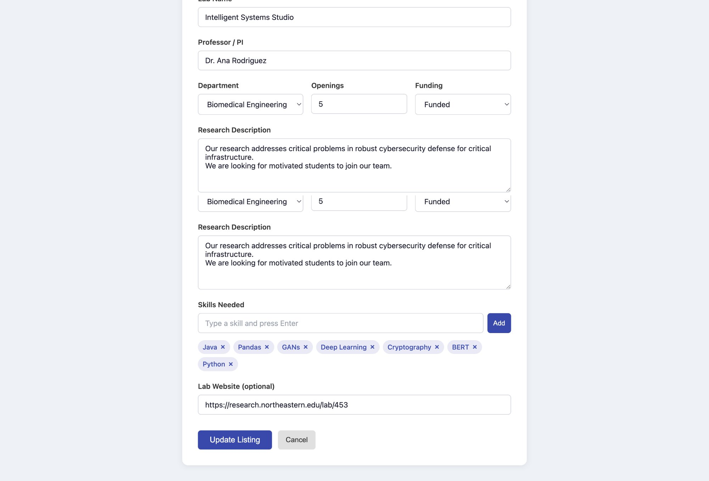

The lab edit form pre-populated for Intelligent Systems Studio. Shows Lab Name, Professor/PI (Dr. Ana Rodriguez), Department (Biomedical Engineering), Openings (5), Funding (Funded), Research Description, and the Skills Needed tag input with existing skills (Java ×, Pandas ×, GANs ×, Deep Learning ×, Cryptography ×, BERT ×, Python ×) all removable. Lab Website pre-filled. Update Listing and Cancel buttons. Submitting hits `PUT /api/labs/:id`.

---

### 4.14 Application Review — Professor View

The application review page for **Intelligent Systems Studio**. Filter tabs at the top: All (0), Pending (0), Accepted (0), Declined (0). When applications are present, each card shows the student's name, match score, personal statement, date received, and Accept (green) / Decline (red) buttons. Only professors can call `PATCH /api/applications/:id/status`. Students attempting this endpoint receive a 403 Forbidden.

---

### 4.15 Delete Lab Confirmation Dialog

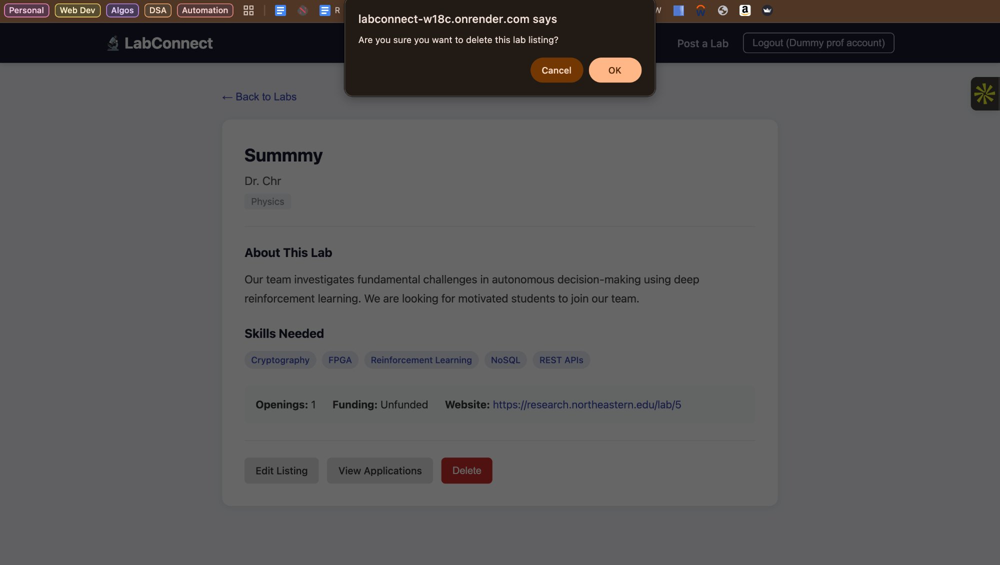

Clicking Delete on a lab listing shows a browser confirmation: "Are you sure you want to delete this lab listing?" On confirmation, `DELETE /api/labs/:id` is called and the listing is removed from the database. The professor is redirected to the Browse Labs page.

---

## 5. Data Model

### Collection: labs

| Field            | Type            | Description                              |
| ---------------- | --------------- | ---------------------------------------- |
| `_id`            | ObjectId        | Primary key                              |
| `name`           | String          | Lab name                                 |
| `professor`      | String          | Professor or PI name                     |
| `department`     | String          | Department                               |
| `description`    | String          | Research description                     |
| `skills_needed`  | Array\<String\> | Required technical skills                |
| `openings`       | Number          | Number of open positions                 |
| `funding_status` | String          | `funded`, `partially_funded`, `unfunded` |
| `website`        | String          | Optional lab website URL                 |
| `created_at`     | Date            | Listing creation timestamp               |

### Collection: profiles

| Field               | Type            | Description                             |
| ------------------- | --------------- | --------------------------------------- |
| `_id`               | ObjectId        | Primary key                             |
| `userId`            | String          | Reference to users collection           |
| `name`              | String          | Student full name                       |
| `email`             | String          | Student email                           |
| `skills`            | Array\<String\> | Technical skills (drives match scoring) |
| `researchInterests` | Array\<String\> | Research interest areas                 |
| `gpaRange`          | String          | GPA range bracket                       |
| `availability`      | String          | Full-time, Part-time, Summer only       |
| `resume_url`        | String          | Optional resume link                    |
| `createdAt`         | Date            | Profile creation timestamp              |

### Collection: applications

| Field         | Type     | Description                            |
| ------------- | -------- | -------------------------------------- |
| `_id`         | ObjectId | Primary key                            |
| `userId`      | String   | Reference to users collection          |
| `profileId`   | String   | Reference to profiles collection       |
| `labId`       | String   | Reference to labs collection           |
| `studentName` | String   | Denormalized student name              |
| `labName`     | String   | Denormalized lab name                  |
| `statement`   | String   | Personal statement (min 50 chars)      |
| `matchScore`  | Number   | Skill match % calculated at apply time |
| `status`      | String   | `pending`, `accepted`, `declined`      |
| `createdAt`   | Date     | Application submission timestamp       |

### Collection: users

| Field       | Type     | Description                     |
| ----------- | -------- | ------------------------------- |
| `_id`       | ObjectId | Primary key                     |
| `name`      | String   | User full name                  |
| `email`     | String   | User email (unique)             |
| `password`  | String   | bcryptjs hash — never plaintext |
| `role`      | String   | `student` or `professor`        |
| `createdAt` | Date     | Registration timestamp          |

---

## 6. API Design

### Authentication Routes

| Method   | Endpoint             | Auth          | Description                             |
| -------- | -------------------- | ------------- | --------------------------------------- |
| `POST`   | `/api/auth/register` | Public        | Register new user                       |
| `POST`   | `/api/auth/login`    | Public        | Sign in with Passport Local             |
| `POST`   | `/api/auth/logout`   | Any           | Destroy session                         |
| `GET`    | `/api/auth/me`       | Any           | Get current session user                |
| `DELETE` | `/api/auth/account`  | Authenticated | Delete account + profile + applications |

### Labs Routes

| Method   | Endpoint        | Auth          | Description                     |
| -------- | --------------- | ------------- | ------------------------------- |
| `GET`    | `/api/labs`     | Any           | List labs with optional filters |
| `GET`    | `/api/labs/:id` | Any           | Get single lab                  |
| `POST`   | `/api/labs`     | Authenticated | Create lab listing              |
| `PUT`    | `/api/labs/:id` | Authenticated | Update lab listing              |
| `DELETE` | `/api/labs/:id` | Authenticated | Delete lab listing              |

### Profiles Routes

| Method   | Endpoint            | Auth                  | Description                   |
| -------- | ------------------- | --------------------- | ----------------------------- |
| `GET`    | `/api/profiles/me`  | Authenticated         | Get own profile               |
| `GET`    | `/api/profiles`     | Any                   | List all profiles             |
| `GET`    | `/api/profiles/:id` | Any                   | Get profile by ID             |
| `POST`   | `/api/profiles`     | Authenticated         | Create profile (one per user) |
| `PUT`    | `/api/profiles/:id` | Authenticated (owner) | Update profile                |
| `DELETE` | `/api/profiles/:id` | Authenticated (owner) | Delete profile                |

### Applications Routes

| Method   | Endpoint                         | Auth                  | Description                                      |
| -------- | -------------------------------- | --------------------- | ------------------------------------------------ |
| `GET`    | `/api/applications`              | Authenticated         | List applications (filter by labId or mine=true) |
| `GET`    | `/api/applications/check/:labId` | Authenticated         | Check if already applied                         |
| `GET`    | `/api/applications/:id`          | Any                   | Get single application                           |
| `POST`   | `/api/applications`              | Authenticated         | Submit application (one per lab)                 |
| `PUT`    | `/api/applications/:id`          | Authenticated (owner) | Update statement                                 |
| `PATCH`  | `/api/applications/:id/status`   | Professor only        | Accept or decline                                |
| `DELETE` | `/api/applications/:id`          | Authenticated (owner) | Withdraw application                             |

---

## 7. Technology Decisions

| Decision     | Choice                        | Rationale                                         |
| ------------ | ----------------------------- | ------------------------------------------------- |
| Runtime      | Node.js v18+                  | Course requirement; non-blocking async I/O        |
| Framework    | Express.js 5                  | Lightweight; matches course videos                |
| Database     | MongoDB Atlas (native driver) | NoSQL flexibility; no Mongoose (prohibited)       |
| Frontend     | React 19 + Vite               | Course requirement for Project 3                  |
| State        | React Hooks                   | `useState`, `useEffect`, `useCallback` throughout |
| Routing      | React Router v7               | Client-side SPA routing                           |
| Auth         | Passport.js (Local Strategy)  | Course requirement; bcryptjs for hashing          |
| HTTP Client  | Native Fetch API              | No Axios (prohibited)                             |
| Hosting      | Render                        | Free tier; auto-deploy from GitHub                |
| Code Quality | ESLint + Prettier             | Zero lint errors; consistent formatting           |
| License      | MIT                           | Open-source; meets rubric requirement             |

---

_Made by Prasad Kanade & Saurabh Lohokare — Northeastern University, Spring 2026_
